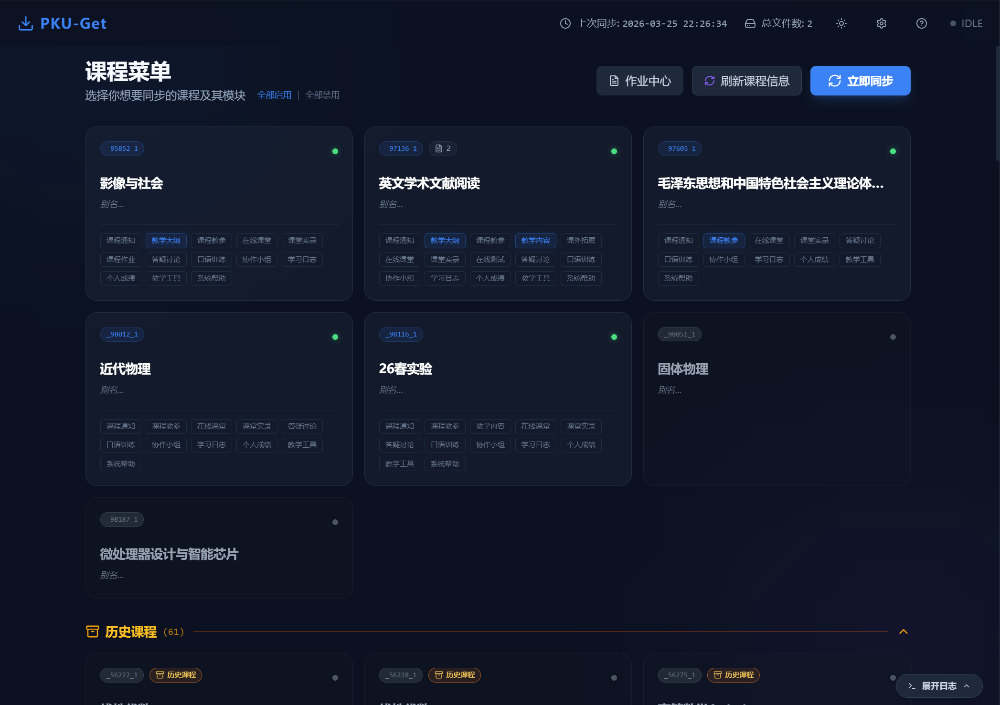

# PKU-Get | 未名拾课

停止点击一千次下载。让 PKU-Get 帮你完成这件事。



[](https://www.python.org/downloads/)
[](https://github.com/yourusername/PKU-AutoDownloader)

[English](#english) | [简体中文](#简体中文)

---

## 简体中文

### 🎯 为什么需要 PKU-Get？

你是否厌倦了：
- 📚 手动点击数百次下载按钮
- 🔄 重复下载相同的文件
- 📁 在混乱的文件夹中查找课程资料
- ⏰ 浪费宝贵的时间在机械劳动上

**PKU-Get 为北大学生而生**，一键同步所有课程资料，节省宝贵的摸鱼时间。

### ✨ 核心功能

#### 🎨 **精美的图形界面**
- 现代化设计，支持浅色/深色主题
- 可视化卡片课程管理
- 实时下载进度追踪
- 一目了然的文件统计

#### ⚡ **智能下载引擎**
- **并发下载**: 同时下载多个文件，速度飞快
- **智能去重**: 自动识别已下载文件，避免重复
- **选择性同步**: 只下载你需要的课程模块

#### 🎛️ **灵活的课程管理**
- 自定义课程显示名称
- 选择特定标签页（作业、课件、公告等）
- 一键启用/禁用课程
- 本地文件夹快速访问
- **助教课程支持**: 自动识别并标记助教课程，访问更多教学资源

#### 🌐 **多浏览器支持**
支持 Chrome、Firefox、Edge、Safari，根据你的系统自动选择最佳浏览器。

### 🚀 快速开始

1. **下载预编译版本**
   
   前往 Releases 页面下载对应平台的安装包
   
   - Windows: PKU-Get-Setup.exe
   - macOS: PKU-Get.dmg

2. **首次运行**
   
   - 输入你的北大学号和密码
   - 选择课程资料保存位置
   - 点击"立即同步"
   
3. **开始下载** 🎉
   - 选择要同步的课程
   - 配置下载选项
   - 坐等资料自动下载完成

### 💻 命令行使用

PKU-Get 也支持命令行操作，适合自动化和高级用户：

```bash
# 基本使用
python main.py

# 下载所有可用标签页
python main.py --all-tabs

# 下载特定标签页
python main.py --tabs "教学内容,课程作业"

# 只下载特定课程
python main.py --course _86268_1

# 预览模式（不实际下载）
python main.py --dry-run

# 组合使用
python main.py --course _86268_1 --tabs "教学内容,课程作业" --dry-run
```

**命令行选项**：
- `--all-tabs`: 下载所有可用的标签页
- `--tabs "标签1,标签2"`: 下载指定的标签页（逗号分隔）
- `--course COURSE_ID`: 只下载指定ID的课程
- `--dry-run`: 预览模式，显示将要下载的内容但不实际下载

### 🎯 高级功能

#### 同步历史记录

每次同步都会生成详细报告，包括：
- ✅ 成功下载的文件列表
- ⏭️ 跳过的文件（已存在）
- ❌ 失败的文件及错误信息

#### 文件管理

- **快速打开**: 点击文件名直接用默认应用打开
- **文件夹访问**: 一键跳转到课程文件夹
- **统计信息**: 实时查看每门课程的文件数量

### 🛠️ 技术架构

```
PKU-AutoDownloader/
├── pku_downloader/          # 核心下载引擎
│   ├── auth/                # 统一身份认证
│   ├── browser/             # 浏览器驱动管理
│   ├── download/            # 下载逻辑
│   ├── config.py            # 配置管理
│   └── logger.py            # 日志系统
├── gui/                     # React 前端
│   ├── src/
│   │   ├── App.jsx         # 主应用
│   │   └── i18n.js         # 国际化
│   └── dist/               # 构建产物
├── main.py                  # CLI 入口
├── gui.py                   # GUI 入口
└── requirements.txt         # Python 依赖
```

**技术栈**:
- **后端**: Python 3.8+, Selenium, BeautifulSoup4, PyWebView
- **前端**: React 19, Vite, Tailwind CSS, Framer Motion

### 🤝 常见问题

Q: 我的密码安全吗？

A: 密码仅存储在本地配置文件中，不会上传到任何服务器。建议设置适当的文件权限保护配置文件。

Q: MacOS上报错：You must enable 'Allow remote automation'

A: MacOS上需要额外的设置。
1. 打开开发者模式
- 首先打开我的浏览器(Safari),默认情况下没有打开开发者模式
- 点击左上角的Safari选择偏好设置
- 勾选在菜单栏中显示"开发"菜单
- 勾选上以后,就会在浏览器功能选项栏里看到"开发"选项
- 下面我们鼠标移动到"开发"看看效果

2. 菜单栏点击开发 ->勾选“允许远程自动化”

详细教程参见：https://blog.csdn.net/weixin_44786530/article/details/129729261


Q: 支持哪些浏览器？

A: Chrome、Firefox、Edge 和 Safari。由于众所周知的原因Chrome的驱动可能难以下载，建议Windows用户优先选择Edge。

Q: 如何下载助教课程？

A: PKU-Get 会自动识别你的助教课程并在课程名前标记 `[助教]`。助教课程包含更多教学资源（如学生成果、教学反思等），使用 `--all-tabs` 选项可以下载所有可用内容。

Q: 为什么提示 "No tabs selected"？

A: 这是因为没有选择要下载的标签页。可以使用 `--all-tabs` 下载所有标签页，或使用 `--tabs "标签名"` 指定特定标签页。

Q: 下载失败怎么办？

A:
1. 确认浏览器驱动已正确安装
2. 尝试重启
3. 把日志发给我（

Q: Chrome/Chromium 驱动问题如何解决？

A: PKU-Get 会自动尝试多种驱动策略：
1. 优先使用系统自动检测的驱动
2. 备选使用 WebDriver Manager 下载
3. 最后尝试常见驱动路径

如果仍有问题，可以：
- Linux: `sudo apt install chromium-chromedriver`
- macOS: `brew install chromedriver`
- Windows: 下载 ChromeDriver 并放到 PATH 中
- 或使用 Firefox 浏览器作为备选方案

Q: 可以定时自动同步吗？

A: 在设置中启用"启动时自动同步"，或使用系统定时任务（如 cron）定期运行命令行版本。

### 🤝 贡献

欢迎提交 Issue 和 Pull Request！

### ⚠️ 免责声明

本工具仅供学习和个人使用，请遵守学校相关规定。作者不对任何滥用行为负责。

### 💖 致谢

感谢我的朋友们的友情测试！
感谢Claude和Gemeni对本项目的大力支持！

如果这个项目对你有帮助，请给个 ⭐️ 支持一下！

---

## English

### 🎯 Why PKU-Get?

Tired of:
- 📚 Clicking download buttons hundreds of times
- 🔄 Re-downloading the same files
- 📁 Searching for course materials in messy folders
- ⏰ Wasting precious time on repetitive tasks

**PKU-Get is built for PKU students** - sync all your course materials with one click and save valuable slacking-off time.

### ✨ Core Features

#### 🎨 **Beautiful GUI**
- Modern design with light/dark theme support
- Visual card-based course management
- Real-time download progress tracking
- Clear file statistics at a glance

#### ⚡ **Smart Download Engine**
- **Concurrent downloads**: Download multiple files simultaneously for blazing speed
- **Smart deduplication**: Automatically detect and skip existing files
- **Selective sync**: Download only the course modules you need

#### 🎛️ **Flexible Course Management**
- Customize course display names
- Select specific tabs (Homework, Courseware, Announcements, etc.)
- Enable/disable courses with one click
- Quick access to local folders
- **TA Course Support**: Automatically identify and mark TA courses with access to additional teaching resources

#### 🌐 **Multi-Browser Support**
Supports Chrome, Firefox, Edge, and Safari. Automatically selects the best browser for your system.

### 🚀 Quick Start

1. **Download Pre-built Release**

   Visit the Releases page to download the installer for your platform

   - Windows: PKU-Get-Setup.exe
   - macOS: PKU-Get.dmg


2. **First Run**

   - Enter your PKU student ID and password
   - Choose where to save course materials
   - Click "SYNC NOW"

3. **Start Downloading** 🎉
   - Select courses to sync
   - Configure download options
   - Sit back and let PKU-Get do the work

### 💻 Command Line Usage

PKU-Get also supports command line operations for automation and advanced users:

```bash
# Basic usage
python main.py

# Download all available tabs
python main.py --all-tabs

# Download specific tabs
python main.py --tabs "教学内容,课程作业"

# Download specific course only
python main.py --course _86268_1

# Preview mode (don't actually download)
python main.py --dry-run

# Combine options
python main.py --course _86268_1 --tabs "教学内容,课程作业" --dry-run
```

**Command Line Options**:
- `--all-tabs`: Download all available tabs
- `--tabs "tab1,tab2"`: Download specific tabs (comma-separated)
- `--course COURSE_ID`: Download only the specified course
- `--dry-run`: Preview mode, show what would be downloaded without actually downloading

### 🎯 Advanced Features

#### Sync History

Each sync generates a detailed report including:
- ✅ Successfully downloaded files
- ⏭️ Skipped files (already exist)
- ❌ Failed files with error messages

#### File Management

- **Quick open**: Click file names to open with default application
- **Folder access**: Jump to course folder with one click
- **Statistics**: Real-time file count for each course

### 🛠️ Technical Architecture

```
PKU-AutoDownloader/
├── pku_downloader/          # Core download engine
│   ├── auth/                # IAAA authentication
│   ├── browser/             # Browser driver management
│   ├── download/            # Download logic
│   ├── config.py            # Configuration management
│   └── logger.py            # Logging system
├── gui/                     # React frontend
│   ├── src/
│   │   ├── App.jsx         # Main application
│   │   └── i18n.js         # Internationalization
│   └── dist/               # Build artifacts
├── main.py                  # CLI entry point
├── gui.py                   # GUI entry point
└── requirements.txt         # Python dependencies
```

**Tech Stack**:
- **Backend**: Python 3.8+, Selenium, BeautifulSoup4, PyWebView
- **Frontend**: React 19, Vite, Tailwind CSS, Framer Motion

### 🤝 FAQ

Q: Is my password safe?

A: Your password is stored only in the local config file and never uploaded to any server. It's recommended to set appropriate file permissions to protect your config.

Q: macOS Error: You must enable 'Allow remote automation'

A: Additional setup is required on macOS:
1. Enable Developer Mode
- First, open Safari (developer mode is disabled by default)
- Click Safari in the menu bar and select Preferences
- Check "Show Develop menu in menu bar"
- After enabling, you'll see the "Develop" option in the menu bar
- Move your mouse to "Develop" to see the options

2. Click Develop in menu bar -> Check "Allow Remote Automation"

For detailed tutorial, see: https://blog.csdn.net/weixin_44786530/article/details/129729261


Q: Which browsers are supported?

A: Chrome, Firefox, Edge, and Safari. Due to well-known reasons, Chrome drivers may be difficult to download. Windows users are recommended to use Edge.

Q: How do I download TA courses?

A: PKU-Get automatically identifies your TA courses and marks them with `[TA]` prefix. TA courses contain additional teaching resources (like student work, teaching reflections, etc.). Use `--all-tabs` option to download all available content.

Q: Why does it say "No tabs selected"?

A: This means no tabs have been selected for download. Use `--all-tabs` to download all tabs, or use `--tabs "tab_name"` to specify specific tabs.

Q: What if downloads fail?

1. Verify browser drivers are installed correctly
2. Try restarting the application
3. Send me the logs (

Q: Can I schedule automatic syncs?

A: Enable "Auto-sync on startup" in settings, or use system schedulers (like cron) to run the CLI version periodically.

### 🤝 Contributing

Issues and Pull Requests are welcome!

### ⚠️ Disclaimer

This tool is for educational and personal use only. Please comply with university policies. The author is not responsible for any misuse.

### 💖 Acknowledgments

Special thanks to Claude and Gemini for their tremendous support in this project.

If this project helps you, please give it a ⭐️!
